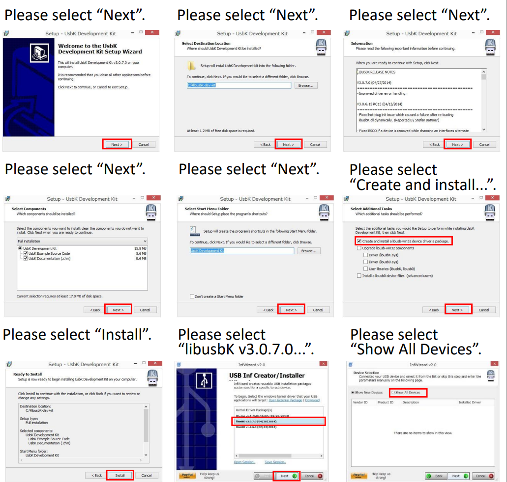
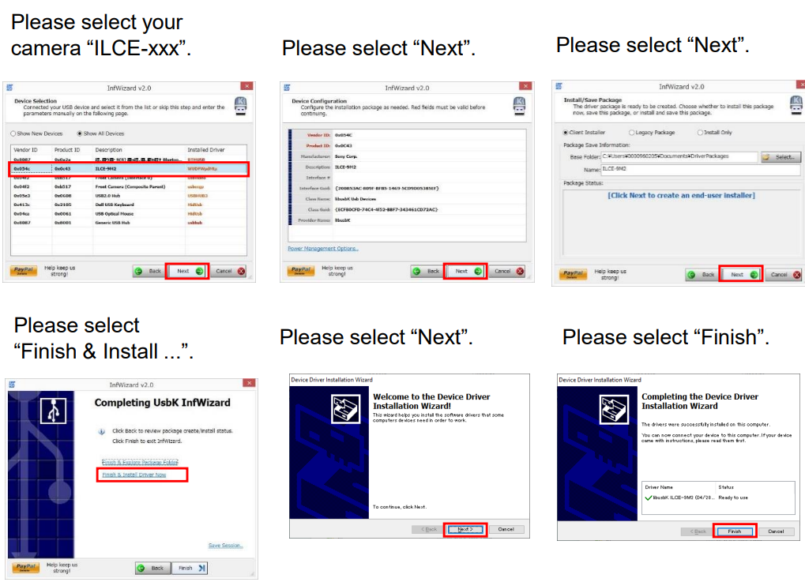

# ptw_sony_automation
This repository consist of the programming to automate the [Sony ILCE-7RM5](https://www.sony.de/interchangeable-lens-cameras/products/ilce-7rm5) using its SDK to automate the camera functionalities.

# Requirements
To run this software the following tools are required:
 - [ ] [Imaging Edge Webcam](https://support.d-imaging.sony.co.jp/app/webcam/en/download/)
 - [ ] [Camera Remote SDK](https://support.d-imaging.sony.co.jp/app/sdk/en/index.html)
 - [ ] [LibusbK Files](https://sourceforge.net/projects/libusbk/files/libusbK-release/3.1.0.0/)
 - [ ] [Visual Studio 2022](https://visualstudio.microsoft.com/vs/)
 - [ ] [Cmake 3.31-1: Windows x64 ZIP](https://cmake.org/download/) --> follow [this video](https://www.youtube.com/watch?v=8_X5Iq9niDE) for the correct installation. Restart your pc if its necessary.
 - [ ] [Windows SDK version 10.0 (and above)](https://developer.microsoft.com/en-gb/windows/downloads/windows-sdk/) --> install either via Visual Studio or via [this video instructions](https://www.youtube.com/watch?v=dk6BYxr3Ovk)
 - [ ] [GStreamer MSVC 64-bits (2019, Release CRT), runtime installer](https://gstreamer.freedesktop.org/download/#windows)
 - [ ] [MSYS2](https://github.com/msys2/msys2-installer/releases/download/2024-12-08/msys2-x86_64-20241208.exe)

Python packages required:
 - [ ] [OpenCV2 4.10.0.84](https://pypi.org/project/opencv-python/)
 - [ ] [Nanoleafapi 2.1.2](https://pypi.org/project/nanoleafapi/)

# Starting the Camera and the SDK

## Connect to the camera
the following instructions were gotten from the Sony SDK Instruction Manual, available in the Camera Remote SDK Folder:
1. Install the Libusbk Files
2. Connect the camera
3. With the camera connected follow the instructions of the image




4. Check if the camera is connected with the "Device Manager", it must be in the "libusbK Usb Device" with the name "ILCE-7RM5"

## GStreamer

To make GStreamer works, it has a complicated installation, which will be described further more. 
1) To start install the Runtime installer using the *complete version* of the installer
2) After installing the GStreamer, you need to add the following commands for the environment variables of Windows 
   2.1) Write Environment Variables in Windows search bar
   2.2) Environment Variables -> System Variables
   2.3) Into PATH add
  ```
  C:\gstreamer\1.0\msvc_x86_64\bin
  C:\gstreamer\1.0\msvc_x86_64\lib
  C:\gstreamer\1.0\msvc_x86_64\include\gstreamer-1.0
  C:\gstreamer\1.0\msvc_x86_64\lib\pkgconfig
  ```
  2.4) Add the env. variable PKG_CONFIG_PATH
  ````
  C:\gstreamer\1.0\msvc_x86_64\lib\pkgconfig
  ````
3) The next step is to install the [MSYS2](https://www.msys2.org/), given above. The in the prompt write:
  ```
  pacman -S mingw-w64-x86_64-pkg-config
  ```
  3.1) You need add to the PATH in the environmental variables the following path:
  ```
  C:\msys64\mingw64\bin
  ```
### How to build the CMAKE File
For this project you can find 4 files:
- src/main.cpp: which contains the main file and start to run the gstreamer_video.cpp
- src/gstreamer_video.cpp: contains the main function which give the properly inputs for the GStreamer to stream the display of the camera
- include/gstreamer.h: contains the headers of gstreamer_video.cpp
- CMakeList.txt: contains the commands to build the project. Here the right connection with the GStreamer toolchain is established.

To build the executable application used by the python application is:
```
cd DIRECTORY_WITH_CMAKE_PROJECT
mkdir build 
cd build
cmake ..\
cmake --build .
cd Debug
.\GStreamerExample.exe
```

If the build folder is not empty, make it empty before building a new solution.

## Build Sony SDK
The following instructions were gotten from the Sony SDK Instruction manual:
1. Extract the SDK in folder, where you want to build
2. in the folder extracted, do: mkdir build
3. cd build
4. cmake -A "x64" -T "v143,host=x64" ..
5. you will find the solution to be opened via Visual Studio in: ./build/RemoteCli.sln
6. After opened, you need to build it.
7. You will find the RemoteCli.exe under the ./build/Debug/RemoteCli.exe

NOTE: if it doesn't work, restart your computer
NOTE 2: Changing the path for the RemoteCli.exe can bring deviations to the SDK Software

# Explanation of the Scripts
## Description
This repository contains 2 single scripts which offer the automation of the platform, controlling the lights LEDs, shutting a photo in the camera and mirror the image of the camera in the pc. The 
scripts main.py **must run pre-configured before initializing**.

## Scripts
The 2 scripts presented are:
- [ ] main.py: this script control the ptw_sony_camera.py, configuring the camera manually with ISO, Shutter Speed and Aperture. The taken picture must be saved in the directory where the main.py 
  function is located. It also start the camera display to mirror in the pc, then the user can check the camera image before shutting a photo. The fourth functionality of this script is to connect 
  with the LEDs and turn on each LED independently. This script interact with the user. 
- [ ] ptw_sony_camera.py: class with the control and connection with the RemoteCli.exe file. It can control the ISO, Shutter Speed and Aperture if the camera is the MANUAL mode. This class take a 
  single picture and store in the path where the python script is located.

## How to use?
the "main.py" script contain in the begging of their sections " ### configuration ### " tab, which the user must interact to the script before run. After that, you must run as normal python script in 
its terminal, as "python main.py". The script can be easily understand with the commands that must be given to control each action wished.

### Additional information

While using the manual configuration of the camera, and you want to configure the ISO, Shutter Speed and aperture, the following information must be followed to right configure the script:

#### ISO
| ISO value | Index in control |
|-----------|------------------|
| ISO AUTO  | 0                |
| ISO 50    | 1                |
| ISO 64    | 2                |
| ISO 80    | 3                |
| ISO 100   | 4                |
| ISO 125   | 5                |
| ISO 160   | 6                |
| ISO 200   | 7                |
| ISO 250   | 8                |
| ISO 320   | 9                |
| ISO 400   | 10               |
| ISO 500   | 11               |
| ISO 640   | 12               |
| ISO 800   | 13               |
| ISO 1.000 | 14               |
| ISO 1.250 | 15               |
| ISO 1.600 | 16               |
| ISO 2.000 | 17               |
| ISO 2.500 | 18               |
| ISO 3.200 | 19               |
| ISO 4.000 | 20               |
| ISO 5.000 | 21               |
| ISO 6.400 | 22               |
| ISO 8.000 | 23               |
| ISO 10.000 | 24               |
| ISO 12.000 | 25               |
| ISO 16.000 | 26               |
| ISO 20.000 | 27               |
| ISO 25.600 | 28               |
| ISO 32.000 | 29               |
| ISO 40.000 | 30               |
| ISO 51.200 | 31               |
| ISO 64.000 | 32               |
| ISO 80.000 | 33               |
| ISO 102.400 | 34               |

### Aperture
| Aperture value | Index in control |
|----------------|------------------|
| F2, 79999      | 0                |
| F3, 19999      | 1                |
| F3, 5          | 2                |
| F4             | 3                |
| F4, 5          | 4                |
| F5             | 5                |
| F5, 59999      | 6                |
| F6, 29999      | 7                |
| F7, 09999      | 8                |
| F8             | 9                |
| F9             | 10               |
| F10            | 11               |
| F11            | 12               |
| F13            | 13               |
| F14            | 14               |
| F16            | 15               |
| F18            | 16               |
| F20            | 17               |
| F22            | 18               |

### Shutter Speed
| Shutter speed | Index in control |
|---------------|------------------|
| Bulb          | 0                |
| 30"           | 1                |
| 25"           | 2                |
| 20"           | 3                |
| 15"           | 4                |
| 13"           | 5                |
| 10"           | 6                |
| 8"            | 7                |
| 6"            | 8                |
| 5"            | 9                |
| 4"            | 10               |
| 3.2"          | 11               |
| 2.5"          | 12               |
| 2"            | 13               |
| 1.6"          | 14               |
| 1.3"          | 15               |
| 1"            | 16               |
| 0.8"          | 17               |
| 0.6"          | 18               |
| 0.5"          | 19               |
| 0.4"          | 20               |
| 1/3           | 21               |
| 1/4           | 22               |
| 1/5           | 23               |
| 1/6           | 24               |
| 1/8           | 25               |
| 1/10          | 26               |
| 1/13          | 27               |
| 1/15          | 28               |
| 1/20          | 29               |
| 1/25          | 30               |
| 1/30          | 31               |
| 1/40          | 32               |
| 1/50          | 33               |
| 1/60          | 34               |
| 1/80          | 35               |
| 1/100         | 36               |
| 1/125         | 37               |
| 1/160         | 38               |
| 1/200         | 39               |
| 1/250         | 40               |
| 1/320         | 41               |
| 1/400         | 42               |
| 1/500         | 43               |
| 1/640         | 44               |
| 1/800         | 45               |
| 1/1.000       | 46               |
| 1/1.250       | 47               |
| 1/1.600       | 48               |
| 1/2.000       | 49               |
| 1/2.500       | 50               |
| 1/3.200       | 51               |
| 1/4.000       | 52               |
| 1/5.000       | 53               |
| 1/6.400       | 54               |
| 1/8.000       | 55               |

# aditional information

developer: Fabio Serra Pereira

e-mail: serrafabio10@outlook.com

Note: to avoid the sharing of this repository, all the changes which were previosly made in C++ script of the SDK were considered irrelevant, therefore the code used is what the Sony distributes.